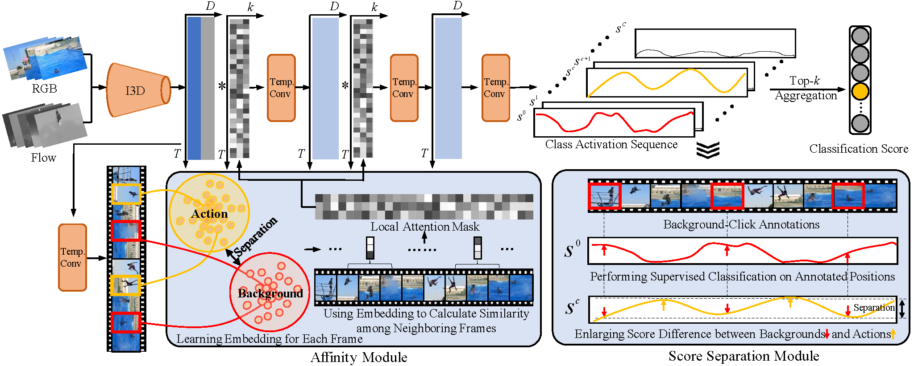

# Background-Click Supervision for Temporal Action Localization

This repository is the official implementation of BackTAL. In this work, we convert existing action-click supervision to the background-click supervision and develop a novel method, called BackTAL. Paper from [arXiv](https://arxiv.org/abs/2111.12449) or [IEEE](https://ieeexplore.ieee.org/document/9633199).




## Requirements

To install requirements:

```setup
conda env create -f environment.yaml
```

## Data Preparation

### Download

Download pre-extracted I3D features of Thumos14,  ActivityNet1.2 and HACS dataset from [BaiduYun](https://pan.baidu.com/s/1bh0Vj5zh3GFhWBKWjklepA) with code ```back```.

	Please ensure the data structure is as below

~~~~
├── data
   └── Thumos14
       ├── val
           ├── video_validation_0000051.npz
           ├── video_validation_0000052.npz
           └── ...
       └── test
           ├── video_test_0000004.npz
           ├── video_test_0000006.npz
           └── ...
   └── ActivityNet1.2
       ├── training
           ├── v___dXUJsj3yo.npz
           ├── v___wPHayoMgw.npz
           └── ...
       └── validation
           ├── v__3I4nm2zF5Y.npz
           ├── v__8KsVaJLOYI.npz
           └── ...
   └── HACS
       ├── training
           ├── v_0095rqic1n8.npz
           ├── v_62VWugDz1MY.npz
           └── ...
       └── validation
           ├── v_008gY2B8Pf4.npz
           ├── v_00BcXeG1gC0.npz
           └── ...
     
~~~~

### Background-Click Annotations

The raw annotations of THUMOS14 dataset are under directory './data/THUMOS14/human_anns'.

## Evaluation

### Pre-trained Models

You can download checkpoints for Thumos14,  ActivityNet1.2 and HACS dataset from [BaiduYun](https://pan.baidu.com/s/19at079XNqu0PWc17YrN3Pw) with code ```back```. These models are trained on Thumos14,  ActivityNet1.2 or HACS using the configuration file under the directory "./experiments/". Please put these checkpoints under directory "./checkpoints".

### Evaluation

Before running the code, please activate the conda environment.

To evaluate BackTAL model on Thumos14, run:

```eval
cd ./tools
python eval.py -dataset THUMOS14 -weight_file ../checkpoints/THUMOS14.pth
```
To evaluate BackTAL model on ActivityNet1.2, run:

```eval
cd ./tools
python eval.py -dataset ActivityNet1.2 -weight_file ../checkpoints/ActivityNet1.2.pth
```

To evaluate BackTAL model on HACS, run:

```eval
cd ./tools
python eval.py -dataset HACS -weight_file ../checkpoints/HACS.pth
```

### Results

Our model achieves the following performance:

### [THUMOS14](https://www.crcv.ucf.edu/THUMOS14/home.html)

| threshold | 0.3  | 0.4  | 0.5  | 0.6  | 0.7  |
| --------- | ---- | ---- | ---- | ---- | ---- |
| mAP       | 54.4 | 45.5 | 36.3 | 26.2 | 14.8 |

### [ActivityNet v1.2](http://activity-net.org/)

| threshold | average-mAP | 0.50 | 0.75 | 0.95 |
| --------- | ----------- | ---- | ---- | ---- |
| mAP       | 27.0        | 41.5 | 27.3 | 4.7  |

### [HACS](http://hacs.csail.mit.edu/)

| threshold | average-mAP | 0.50 | 0.75 | 0.95 |
| --------- | ----------- | ---- | ---- | ---- |
| mAP       | 20.0        | 31.5 | 19.5 | 4.7  |

## Training

To train the BackTAL model on THUMOS14 dataset, please run this command:

```train
cd ./tools
python train.py -dataset THUMOS14
```
To train the BackTAL model on ActivityNet v1.2 dataset, please run this command:

```train
cd ./tools
python train.py -dataset ActivityNet1.2
```

To train the BackTAL model on HACS dataset, please run this command:

```train
cd ./tools
python train.py -dataset HACS
```

## Citing BackTAL

```
@article{yang2021background,
  title={Background-Click Supervision for Temporal Action Localization},
  author={Yang, Le and Han, Junwei and Zhao, Tao and Lin, Tianwei and Zhang, Dingwen and Chen, Jianxin},
  journal={IEEE Transactions on Pattern Analysis and Machine Intelligence},
  year={2021},
  publisher={IEEE}
}
```

## Contact
For any discussions, please contact [nwpuyangle@gmail.com](mailto:nwpuyangle@gmail.com).
